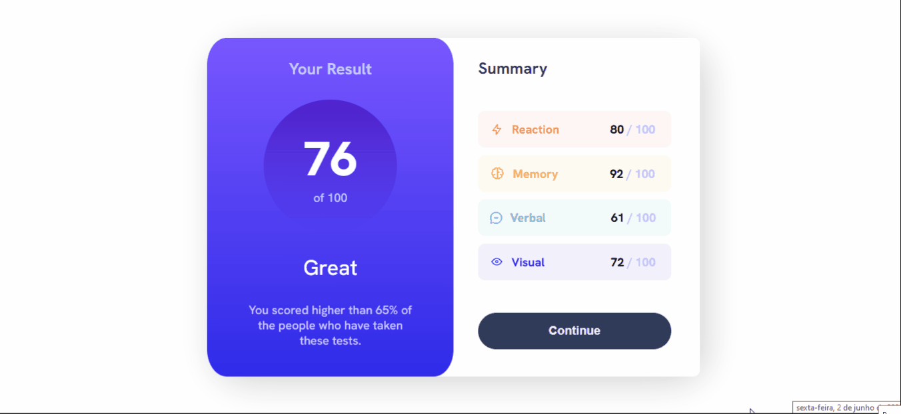

# Frontend Mentor - Results summary component solution

Essa é uma solução do [Results summary component challenge on Frontend Mentor](https://www.frontendmentor.io/challenges/results-summary-component-CE_K6s0maV). Um desafio do Frontend Mentor, que me ajudou a me manter praticando minhas habilidades com o código, construindo projetos realistas.

## Tabela de conteúdos

- [Geral](#geral)
  - [O Desafio](#o-desafio)
  - [Captura de Tela](#captura-de-tela)
  - [Links](#links)
- [Meu processo](#meu-processo)
  - [Construído com](#contruido-com)
  - [O que aprendi](#o-que-aprendi)
  - [Desenvolvimento continuado](#desenvolvimento-continuado)
  - [Pesquisas](#pesquisas)
- [Autor](#autor)


## Geral

### O Desafio

Os usuários devem poder: 

- Ver o melhor layout possível, dependendo do tamanho da tela de seus aparelhos
- Ver os estados ativos para todos os elementos interativos da página

### Captura de Tela




## Meu processo

### Construído com

- Marcação de HTML5 semântica
- Propriedades customizadas do CSS
- Flexbox
- Grid

### O que aprendi

Este projeto está relacionado à manutenção de habilidades já aprendidas com HTML e CSS. É meu segundo desafio após  um mês sem praticar e foi ótimo para mim voltar à fazê-lo com este projeto, afinal, consegui rever propriedades do grid e de flexbox, essenciais para um bom posicionamento do projeto. 

É um projeto simples, prático e dinâmico. A propriedade do CSS 'background-image' me surpreendeu. É uma propriedade muito volúvel e adaptável para o que se precisa de uma forma geral. Neste projeto, ela me ajudou a criar um gradiente de cores no cartão central. 


```css
.orgulho-desse-css {
  background-image: linear-gradient(to bottom, var(--violet-blue), var(--persian-blue));
}
```

### Desenvolvimento continuado

O flexbox, grid e suas propriedades respectivas me ajudaram muito a criar uma boa estilização, para que alcançasse o objetivo deste exercício. Sinto que ainda não domino completamente e continuarei a utilizá-los porque sei da importância que tem.

Pretendo aprender possibilidades de refatoração de código, para deixá-lo mais limpo com o tempo. Entretanto, já fiquei bastante feliz com o que fiz e sei que futuramente melhorarei ainda mais.


### Pesquisas

- [Propriedade background-image, com foco no linear-gradient, do CSS](https://maujor.com/tutorial/css3-gradientes-lineares.php) - Ela me ajudou a entender como utilizar a propriedade background-image, com foco na nova possibilidade que descobri do linear-gradient, do CSS. Gostei muito deste conteúdo e pretendo continuar utilizando-o para aprender mais e mais sobre esta propriedade. 

## Autor

- Linkedin - [Diassis Guerreiro](linkedin.com/in/diassis-guerreiro/)
- Instagram - [@_di4ssis](https://www.instagram.com/_di4ssis/)